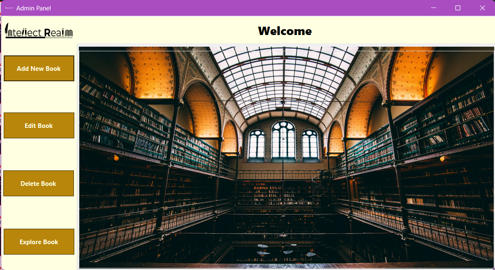
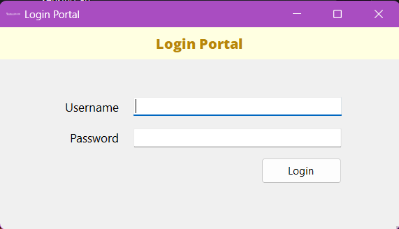

# 📚 Library Management System (LMS)

A lightweight desktop-based Library Management System designed to streamline book tracking, user authentication, and basic library operations. Built as a prototype suitable for small libraries transitioning from manual record-keeping.

---

## 🚀 Features

- 🔐 **Secure Login System**  
  Basic authentication with masked password input.

- 🖥 **Clean WinForms UI**  
  Structured interface with anchored controls for a smooth user experience.

- 📁 **Expandable Architecture**  
  Designed with placeholders for future CRUD operations and database integration.

- ⚙️ **Error Handling**  
  Clear feedback with message dialogs for incorrect credentials.

---

## 🛠 Current Prototype Workflow

1. Application starts with a modal Login Form
2. User enters credentials
3. On success, access is granted to the main form (future dashboard)
4. Invalid input triggers an error message

---

## 📌 Folder Structure Overview

```
LibraryManagementSystem
│── Form1.cs # Login form logic
│── Form1.Designer.cs # UI layout for Login Form
│── Program.cs # Application entry point
│── Properties/ # Resources and settings
│── bin/ # Build output
└── obj/ # Build artifacts
```

---

## 🧩 Future Enhancements

- Database connection (SQLite or SQL Server)
- Full CRUD features for Books, Members, Loans
- Role-based authentication (Admin, Librarian)
- Reporting tools (PDF/CSV export)
- Modernized dashboard UI
- Activity logs and backups

---

## 📸 Screenshots





---

## 🔧 Requirements

- .NET 8 SDK
- Visual Studio 2022 or later
- Windows OS (WinForms-supported)

---

## ▶️ How to Run

1. Clone the repository:
   ```bash
   git clone https://github.com/YourUsername/LibraryManagementSystem.git
   ```
2. Open the solution in Visual Studio

3. Set the project as Startup Project

4. Click Start (F5) to run the application

## ⭐ Like this project?

If you found this useful, consider giving it a star ⭐ on GitHub!

---

If you want, I can also generate:

✅ GitHub project banner  
✅ License file (MIT recommended)  
✅ Contribution guidelines  
✅ A more advanced README with diagrams

Just tell me!
